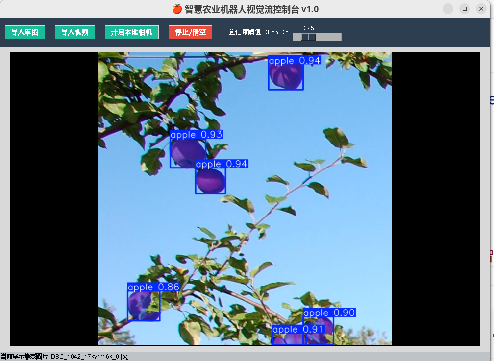
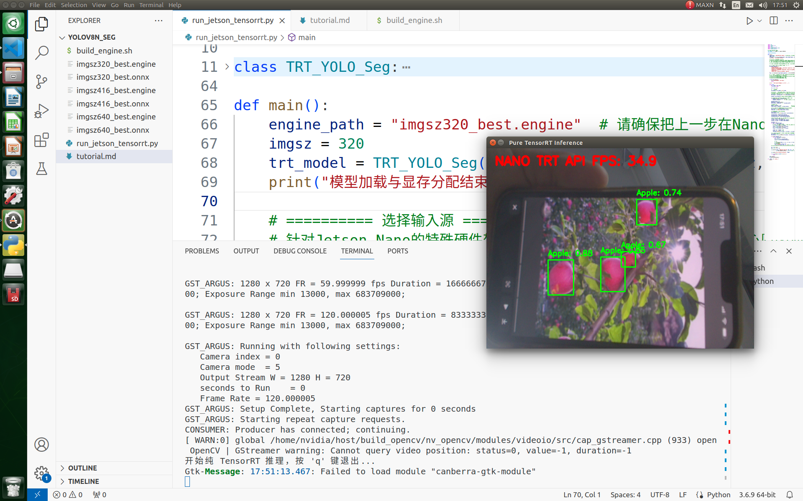

<div align="center">
  <h1>🍎 YOLO-AgriSeg-Jetson: Visual Perception System for Agricultural Picking Robots</h1>
  <p>The ultimate evolution from a YOLOv8+SAM cascaded architecture to a fully convolutional YOLO-seg model, breaking the physical deployment limits of edge computing platforms (Jetson Nano B01) in a full-stack open-source project.</p>
  <p>
    
    
    
    
  </p>
</div>

## 🎥 Visualizations

<div align="center">
  
  <br>
  <sup>Native TensorRT imgsz=320 Real-time Inference and Rendering on Jetson Nano</sup>
  <br><br>
  
  <br>
  <sup>Cross-platform Host GUI with Real-time Conf Slider Dynamic Feedback</sup>
  <br><br>
  
  <br>
  <sup>Edge-side Display in High-Speed imgsz=320 Mode</sup>
</div>

## 🌟 Key Features

> 📖 **Deep Reading**: For detailed insights into how this project solves robotic edge computing bottlenecks and the rationale behind migrating from the YOLO+SAM cascaded architecture to the monolithic YOLO-seg, please refer to the [Pipeline Evolution Analysis](pipeline_evolution_analysis_en.md).

- **🤖 Zero-Cost Pixel-level Annotation (Auto-Annotation)**
  - Completely eliminates the exorbitant cost of manual polygon annotation. Utilizes **SAM (Segment Anything)** for a one-time offline process, automatically distilling simple bounding boxes (BBox) into native polygon masks required for YOLOv8-seg training.
- **⚡ Architecture Evolution (YOLOv8n+SAM ⟶ YOLOv8n-seg)**
  - Dropped the sluggish dual-model Prompt cascaded pipeline. By retraining an end-to-end monolithic YOLOv8n-seg model, it achieves a high precision of `mAP50 96.26%` on the apple dataset, with inference complexity plummeting to `O(1)`.
- **💻 Cross-Platform Native GUI Workstation (Tkinter + OpenCV)**
  - Rejects bloated PyQt/Web frameworks and uses pure Python native standard libraries to build an ultra-low-overhead host machine. It supports importing images, videos, or connecting to local cameras, and features **dynamic mask refreshing via a confidence slider**.
- **📊 MOT Multi-Object Trajectory Yield Counting (ByteTrack)**
  - Assisted by `lapx` and Virtual Crossing Line logic, it enables the robot to count while moving, providing de-duplicated yield estimation for the orchard assembly line.
- **☠️ Extreme Edge Deployment (Jetson Nano B01)**
  - Hardware adapter for (Maxwell core, JetPack 4.6.1, Python 3.6.9). Rejects INT8 negative optimization, locking into the compatible golden standard of `FP16` + `opset=12`.
  - **Completely breaks free from bloated high-level libraries like `ultralytics`**. Built a high-speed data pipeline using pure `PyCUDA` + `TensorRT` APIs, leveraging a native GStreamer ISP to solve low-level green-screen distortions caused by CSI capturing. Includes manual C++ tensor matrix unpacking and a custom Numpy NMS parser, running stably at 30+ FPS at imgsz=320.

## 📂 Project Structure

```text
YOLO-AgriSeg-Jetson/
├── tools/                  # Auxiliary tool modules and demo applications
│   ├── auto_annotate_all.py# Fully automated dataset annotation script (BBox -> Polygon)
│   ├── gui_control_station.py # Windows/Linux cross-platform host GUI control station
│   └── track_and_count.py  # ByteTrack apple yield video limit streaming and counting
├── train/                  # Model training, inference validation, and standard exporting
│   ├── main_pipeline.py    # Early YOLO+SAM dual-architecture test pipeline
│   ├── main_yolo_seg.py    # YOLOv8-seg monolithic validation and inference logic
│   ├── train_yolo.py       # Standard YOLO initial object detection training
│   ├── train_yolo_seg.py   # YOLO-seg network core fine-tuning script
│   ├── export_tensorrt.py  # Basic detection model exporter
│   └── export_yolo_seg_tensorrt.py # Segmentation-level model native export interface
├── deploy/                 # Core edge deployment for development boards (Jetson)
│   ├── build_engine.sh     # Jetson Nano local trtexec engine compilation entry
│   ├── export_jetson_tensorrt.py # Pre-generation of highly compatible opset=12 export
│   └── run_jetson_tensorrt.py # Jetson high-speed bare metal inference without Ultralytics C++-Binding
├── visualization/          # Screenshots and GIF materials library
├── data/                   # Dataset containing raw bounding boxes and reconstructed Polygons
├── summary_en.md           # [Pitfall Guide] Full record of architecture evolution and principles
├── requirements.txt        # Standalone dependency packages for PC / Dev board
└── README_en.md            # Main project documentation
```

## 📦 Dataset
The apple orchard dataset used in this project can be downloaded via the following link:
👉 **[Apple Orchards Vision Dataset (AppleBBCH81)](https://www.kaggle.com/datasets/projectlzp201910094/applebbch81)**

The original dataset only contains rectangular Bounding Box annotations for object detection. You can use the `tools/auto_annotate_all.py` script provided in this project, leveraging SAM to automatically generate Polygon masks for YOLO-seg training.

## 🚀 Quick Start

### 1. Install Host Environment
```bash
git clone https://github.com/Dingshichun/YOLO-AgriSeg-Jetson.git
cd YOLO-AgriSeg-Jetson
conda create -n agrivision python==3.10
conda activate agrivision
pip install -r requirements.txt
```
*Note: Tracking dependencies like `lapx` are included, but `pycuda` and `tensorrt` are Jetson-bound and should be compiled as needed.*

### 2. Run Interactive Control Station (GUI)
If you want to experience zero-latency inference parameter tuning on your development machine or a desktop-enabled robot:
```bash
python gui_control_station.py
```

### 3. Fully Automated Data Annotation (using SAM)
Modify the input dataset path in `tools/auto_annotate_all.py` to instantly generate corresponding instance segmentation Mask Polygon TXT text for wild datasets that only have standard pure Box annotations:
```bash
python tools/auto_annotate_all.py
```

## 🧱 Jetson Nano Deployment Summary
To run the latest segmentation model smoothly at 20+ FPS on outdated edge boards, please carefully read [`summary_en.md`](summary_en.md) and the detailed comments in `deploy/run_jetson_tensorrt.py`. This project successfully bridges the following technical gaps:
1. **OOM and OpSet Incompatibility**: Strictly locks `opset=12`, `workspace=2048`, `imgsz=416` during export on the development machine side.
2. **Quantization Reverse Slowdown Pitfall**: Avoids the INT8 software decoding trap, utilizing the full-blooded native FP16 equipped in the hardware architecture.
3. **CSI Hardware ISP Distortion**: Bypasses the Linux V4L2 protocol YUYV empty/full load green screen and Bayer demosaicing failure, using GStreamer + `nvarguscamerasrc` to build the pipeline decode.
4. **Unpacking Array Penetration**: Low-level decoupling of TensorRT native inference and C++ tensor structures, hand-writing a Numpy data mapping conversion bridge to reconstruct the NMS detection logic.

## 📄 License
This project is distributed under the [MIT License](LICENSE). Communications and secondary development are highly welcome.